# aegis-operations Architecture

**Document status:** Living architecture specification  
**System version:** 0.1.0  
**Last updated:** 2026-09-02  
**Audience:** Engineers, security reviewers, operators, contributors, and hackathon judges

## 1. Executive summary

`aegis-operations` is a human-and-agent security investigation system. It ingests security
telemetry, retains the original record, creates a pragmatic normalized representation,
runs deterministic detection rules, and turns findings into persistent investigations.
A human analyst and a browser agent operate on the same evidence, hypotheses, and audit
timeline through the same backend domain services.

The defining boundary is:

> Deterministic systems retrieve and verify facts. Humans and agents interpret those
> facts together. Only a human can finalize the verdict.

The current application is a demonstration-scale, single-container system using React,
FastAPI, SQLAlchemy, and SQLite. The production architecture retains that modular
monolith until measured scale or availability requirements justify replacing individual
components. It does not begin life as a swarm of tiny services desperately trying to
remember why they exist.

This document distinguishes two levels throughout:

- **Implemented:** behavior present in the current repository.
- **Production target:** hardening or scale work required before operating on real
  organizational telemetry.

## 2. Architecture objectives

### 2.1 Functional objectives

1. Preserve source telemetry without silently changing its meaning.
2. Normalize only the fields required for search, detection, and investigation.
3. Generate findings through deterministic, reproducible detection logic.
4. Give analysts a dense interface for inspecting raw and normalized evidence.
5. Maintain evidence and hypotheses as first-class shared state rather than burying
   them in an AI conversation.
6. Expose safe, typed investigation capabilities to browser agents through WebMCP.
7. Attribute every material case mutation to a human, agent, or system actor.
8. Keep the manual investigation workflow available when WebMCP or an agent is absent.

### 2.2 Quality objectives

The priorities are ordered deliberately:

1. **Evidence integrity:** conclusions must resolve to persisted telemetry and stable IDs.
2. **Security:** telemetry and tool results are untrusted, and agent authority is narrow.
3. **Auditability:** mutations are attributable and reconstructable.
4. **Correctness:** deterministic queries and rules must be reproducible.
5. **Operability:** one deployable unit, explicit configuration, health checks, backups.
6. **Usability:** analysts can work at high information density without relying on chat.
7. **Performance:** interactive search and case updates at the intended data volume.
8. **Replaceability:** storage, detection, and ingestion boundaries can evolve independently.

### 2.3 Non-goals

The system is not currently intended to be:

- A full SIEM or long-term security data lake.
- A universal telemetry schema implementation.
- A real-time streaming platform.
- A SOAR platform that autonomously contains hosts or disables accounts.
- A multi-agent orchestration framework.
- A replacement for analyst judgment.
- A high-availability, multi-region service in its MVP form.

## 3. System context

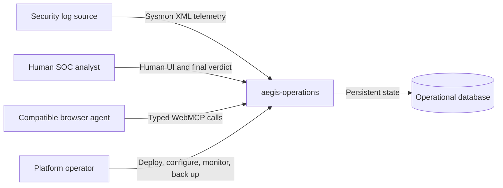

### 3.1 External actors

| Actor | Needs | Permitted actions |
|---|---|---|
| Human analyst | Inspect telemetry and reach a decision | Search, create cases, pin evidence, edit hypotheses, set verdict |
| Browser agent | Assist with bounded investigation work | Read scoped data and mutate evidence/hypotheses through WebMCP |
| Data producer | Supply security records | Submit or provide records to an authorized ingestion source |
| Operator | Keep the system reliable and secure | Configure, deploy, monitor, migrate, restore, rotate secrets |
| Auditor | Review provenance and decisions | Read immutable or append-only investigation activity |

## 4. Trust boundaries

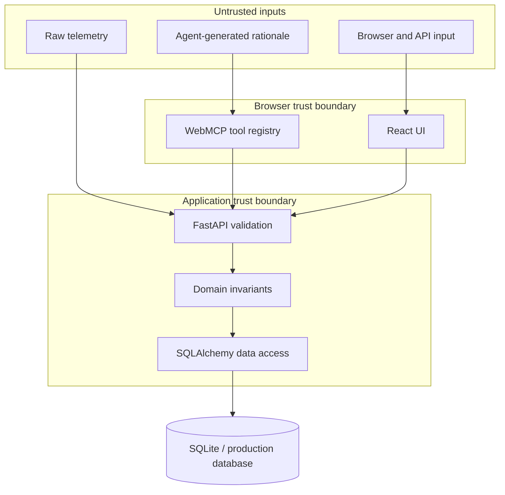

The system never treats these as trusted merely because they arrived through an agent
or a typed interface:

- Raw log fields, including command lines, filenames, DNS names, and embedded text.
- WebMCP tool descriptions or results.
- Agent-generated explanations, confidence scores, and evidence selections.
- Client-supplied actor labels, identifiers, filters, or verdicts.

The browser schema improves reliability; it is not the security boundary. FastAPI
validation, authorization, domain checks, database constraints, and audit policy are
the security boundary.

## 5. Runtime architecture

### 5.1 Current container view

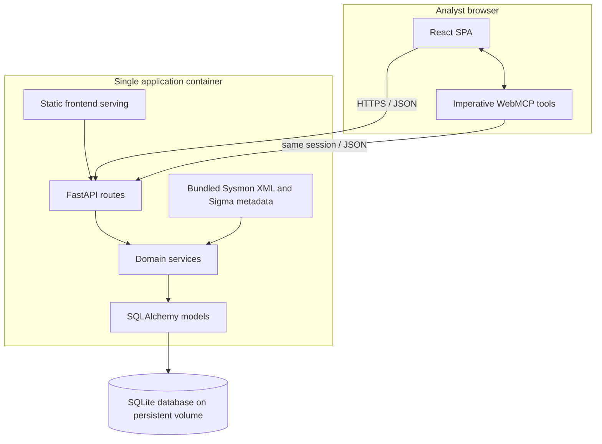

### 5.2 Production target

The preferred first production deployment remains a modular monolith:

```mermaid
flowchart LR
    User[Browser]
    Edge[TLS edge / reverse proxy]
    App[Stateless application instance]
    DB[(PostgreSQL primary)]
    Replica[(Read replica, optional)]
    Object[(Encrypted object storage)]
    Queue[(Durable job queue, optional)]
    Worker[Ingestion/detection worker, optional)]
    Obs[Logs, metrics, traces]

    User --> Edge --> App
    App --> DB
    DB -. read scale .-> Replica
    App --> Object
    App -. asynchronous heavy work .-> Queue --> Worker
    Worker --> DB
    App --> Obs
    Worker --> Obs
```

PostgreSQL, object storage, and background workers are evolutionary replacements, not
day-one requirements. They are introduced only when concurrency, dataset size, retention,
or ingestion latency demonstrates the need.

## 6. Source tree and module ownership

The present source tree is intentionally compact:

```text
app/
├── backend/
│   ├── data/                   # attributed Splunk Attack Data Sysmon XML
│   ├── rules/                  # attributed upstream SigmaHQ rules
│   ├── database.py             # engine, session, declarative base
│   ├── ingestion.py            # XML framing, safe parsing, normalization
│   ├── main.py                 # FastAPI composition and routes
│   ├── models.py               # persistence entities and relationships
│   ├── schemas.py              # bounded request validation
│   ├── sigma_engine.py         # pySigma compilation and SQL execution
│   └── services.py             # ingestion, detection, query, case domain logic
└── frontend/
    ├── src/
    │   ├── api.ts              # HTTP adapter
    │   ├── App.tsx             # current UI composition
    │   ├── types.ts            # frontend data contracts
    │   ├── webmcp.ts           # WebMCP schemas and handlers
    │   └── styles.css           # visual system
    └── vite.config.ts
tests/
└── test_services.py            # domain and invariant tests
```

### 6.1 Production module extraction

As the codebase grows, split modules by business capability while retaining one
deployable application:

```text
backend/
├── api/
│   ├── dependencies.py
│   ├── errors.py
│   └── routes/{datasets,events,findings,investigations}.py
├── application/
│   ├── ingestion.py
│   ├── detection.py
│   ├── queries.py
│   └── investigations.py
├── domain/
│   ├── entities.py
│   ├── policies.py
│   ├── state_machines.py
│   └── errors.py
├── infrastructure/
│   ├── repositories/
│   ├── log_sources/
│   ├── detection_engines/
│   └── persistence/
└── observability/
```

Extraction is justified when `services.py` begins to mix unrelated transaction
boundaries or becomes difficult to test independently. Folder count is not an
architecture metric; meaningful boundaries are.

## 7. Backend component architecture

### 7.1 API layer

Responsibilities:

- Terminate HTTP requests.
- Parse and validate path, query, and body inputs.
- Establish the database-session scope.
- Convert domain failures into stable HTTP error responses.
- Apply response security headers.
- Serve the built SPA in a production image.

The API layer must not contain detection decisions or investigation policy.

### 7.2 Application/domain services

Current implementation groups the following in `services.py`:

- Dataset ingestion and idempotency.
- Source-specific normalization.
- Deterministic rule evaluation.
- Event search, context, and aggregation.
- Finding retrieval.
- Investigation creation and mutation.
- Evidence and hypothesis integrity checks.
- Verdict and incident transitions.
- Audit-event creation.

Production services should expose explicit commands and queries:

```text
Commands
  IngestDataset
  StartInvestigation
  AddEvidence
  CreateHypothesis
  UpdateHypothesis
  SetVerdict

Queries
  SearchEvents
  GetEventContext
  AggregateEntityActivity
  GetFinding
  GetInvestigationContext
```

Commands own transaction boundaries. Queries must not mutate state.

### 7.3 Repository boundary

The current implementation uses SQLAlchemy sessions directly. A production repository
layer becomes useful when PostgreSQL is introduced or query complexity grows. It should
be narrow and use domain-specific operations rather than generic CRUD wrappers:

```python
class InvestigationRepository(Protocol):
    def get_for_update(self, investigation_id: str) -> Investigation: ...
    def add_evidence(self, evidence: Evidence) -> None: ...
    def append_event(self, event: InvestigationEvent) -> None: ...
```

Avoid a repository abstraction for every table. Tables are implementation details;
aggregate and transaction boundaries are the useful seam.

### 7.4 Ingestion boundary

The conceptual source interface is:

```python
class LogSource(Protocol):
    async def read(self) -> AsyncIterator[RawRecord]: ...
```

Implemented source:

- Three bundled Splunk Attack Data Sysmon XML streams covering T1003.001, T1059.001,
  and T1105. Records are framed on the
  `</Event>` boundary because valid command lines may contain embedded newlines; parsing
  one physical line as one event would silently corrupt the dataset.

Production candidates:

- Uploaded file source.
- Object-storage source.
- Authenticated pull connector.
- Streaming source only when latency requirements demand it.

Every source must produce a stable source identifier and preserve the exact original
payload or a cryptographic reference to it.

### 7.5 Detection boundary

The application uses one deterministic detection adapter:

- `SigmaDetectionEngine`: official Sigma YAML is parsed by pySigma, processed through
  the official Sysmon pipeline, compiled by the SQLite backend, and executed against
  the case-preserving `sigma_events` projection.

Every Sigma finding includes the source rule UUID, authors, status, DRL-1.1 license,
upstream URL, backend/pipeline identity, and exact generated query. The application
does not reinterpret a zero-match rule into a match.

The offline rule pack is pinned to SigmaHQ commit
`8375f87fc85224a96ec133266ea934a3338246ba`; provenance URLs use that immutable commit
rather than a moving branch. Adding a YAML file registers it through deterministic
directory discovery, but it must still compile and execute without a compatibility error.

The implemented correlation fingerprint is source + host + process basename + fixed
one-hour UTC bucket. Every `(rule_id, event_id)` result is preserved as a
`detection_signal`; distinct supporting events are linked separately through
`finding_events`. With all reference sources ingested, 29 of 30 curated rules produce
276 signals over 133 distinct events. Correlation creates 22 analyst-facing groups and
records 143 overlapping signals instead of rendering them as duplicate work items.

Each group stores all contributing rule IDs, first/last seen, risk score, confidence,
signal count, distinct-event count, and suppressed-overlap count. The highest-severity
rule is the deterministic primary rule used for headline and provenance rendering.
Production must prepend tenant identity, externalize the time-window policy, version the
fingerprint, and support governed rule-family correlation where process identity is not
the correct entity boundary.

The current risk score is a bounded deterministic prioritization heuristic combining
maximum Sigma severity, contributing-rule count, and distinct-event volume. Confidence
measures corroboration strength from content status, rule agreement, and overlapping
signals; it is not a calibrated probability that activity is malicious. Both formulas
must be versioned, validated against labeled outcomes, and exposed to analysts before
production use.

The production interface should be:

```python
class DetectionEngine(Protocol):
    def evaluate(
        self,
        events: Iterable[NormalizedEvent],
        rules: Iterable[DetectionRule],
    ) -> Iterable[DetectionResult]: ...
```

Future Sigma expansion must define what is supported and reject unsupported constructs. Quietly
misinterpreting a rule is worse than refusing it.

## 8. Frontend architecture

### 8.1 Responsibilities

The frontend provides:

- Human-readable visualization of the same server state agents manipulate.
- Search and filtering controls.
- Deterministically ordered 25/50/100-row event pagination with first, previous, next,
  and last-page controls.
- Raw and normalized telemetry inspection.
- Signal-versus-group metrics, finding triage, and investigation creation.
- Evidence, hypothesis, provenance, timeline, and verdict workflows.
- Numbered Overview → Alerts → Investigations navigation with page-level task guidance.
- A staged investigation workbench that makes related events, evidence, hypothesis, and
  verdict the primary human path while keeping agent collaboration optional.
- An explicit evidence contract: a related event is only a lead until a human or agent
  verifies its normalized fields against the original source and records a rationale tied
  to an observable field. Evidence is then persisted with provenance in shared case state.
- Progressive disclosure of large related-event sets: eight rows are initially visible,
  while a deliberate control reveals the complete set without losing investigation scope.
- Persistent system-aware light and dark themes.
- A same-origin pre-render theme bootstrap applies the stored or operating-system preference
  before the React bundle and loading state paint, preventing a flash of the opposite theme.
- Shared typography and spacing tokens: locally bundled Geist Sans is used for interface
  prose; JetBrains Mono is limited to IDs, counts, source records, and executable detection
  content. Bundling avoids a runtime dependency on a third-party font CDN.
- Top-level WebMCP tool registration.
- Graceful fallback when WebMCP is unavailable.

The event review drawer has two intentionally different representations. **Normalized
fields** are the analyst's scannable working view. **Original source** is the verification
view and preserves source content while wrapping unbroken command lines and XML so the
drawer cannot overflow the viewport. Adding evidence requires a non-empty explanation of
why the record supports or challenges the current hypothesis.

### 8.2 Investigation lifecycle

Investigation state has operational meaning rather than being a display-only label:

```text
Alert NEW ──start──> Alert INVESTIGATING + Investigation OPEN
                                      │
               BENIGN / SUSPICIOUS / INCIDENT verdict
                                      │
                                      ▼
                    Investigation CLOSED (read-only history)
                    Alert CLOSED or ESCALATED

               INCONCLUSIVE verdict ──> Investigation remains OPEN
```

- Only `OPEN` investigations may accept evidence, hypotheses, hypothesis updates, or a
  verdict. The API returns HTTP 409 for attempted mutations against a closed case.
- Closed records retain evidence, hypotheses, provenance, activity, and the human verdict
  for audit, but are excluded from the active WebMCP investigation context.
- Default alerts and overview metrics report operationally open work. Total and resolved
  counts remain available so closure does not erase historical detection output.
- An `INCIDENT` verdict additionally creates an incident and marks the source alert
  `ESCALATED`; other conclusive verdicts mark it `CLOSED`.

### 8.3 State model

Server state is authoritative. The React application may cache responses, but durable
investigation state never lives only in a component or browser store.

Current refresh behavior:

1. Human actions call the backend and refresh shared state.
2. WebMCP write handlers call the same backend API.
3. Successful tool mutations emit `webmcp:mutation` in the page.
4. React reloads workspace, findings, rules, and investigations. The telemetry explorer
   loads its bounded search page independently so case mutations do not unexpectedly
   discard the analyst's event navigation context.

Production evolution:

- Adopt a query cache such as TanStack Query for scoped invalidation.
- Add SSE for changes originating outside the current page.
- Use optimistic updates only when rollback behavior is explicit.
- Preserve server-provided versions to prevent lost updates.

### 8.4 UI feature boundaries

As the frontend grows, extract:

```text
features/
├── telemetry/
├── findings/
├── investigations/
├── evidence/
├── hypotheses/
└── agent-activity/
```

Each feature should contain presentation components, query hooks, mutations, and tests.
The HTTP client and WebMCP adapter remain infrastructure shared across features.

## 9. Data architecture

### 9.1 Entity relationship model

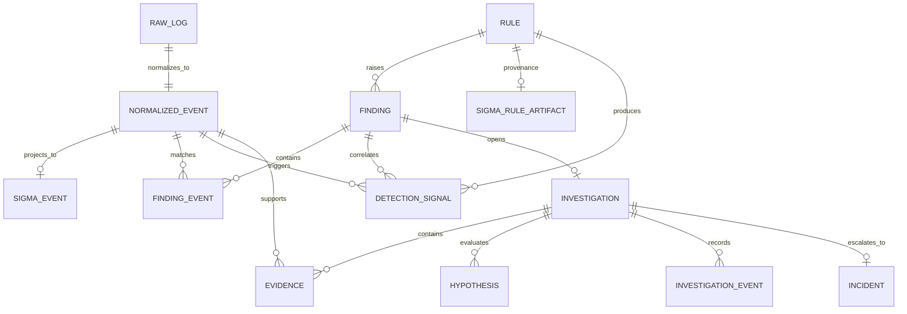

### 9.2 Tables and invariants

#### `raw_logs`

Purpose: immutable source-of-truth representation of an ingested record.

Key fields:

- Integer storage ID.
- Unique source record ID.
- Source name.
- Original text payload.
- Ingestion timestamp.

Invariant: normalization may fail without modifying or discarding the raw record.

Production additions:

- Tenant and dataset IDs.
- SHA-256 content digest.
- Source offset/object key.
- Parser status and rejection reason.
- Payload encryption or object-storage pointer.

#### `normalized_events`

Purpose: searchable, detection-ready projection of a raw record.

Key fields:

- Stable event ID.
- UTC timestamp, source, and event type.
- Host, user, process, and parent process.
- Source and destination IP.
- Command line.
- Additional source-specific JSON.
- Unique reference to the raw record.

Invariant: a normalized event references exactly one raw record; the raw record remains
available for verification.

#### `rules`

Purpose: versionable detection metadata.

Key fields:

- Rule ID and name.
- Severity and description.
- MITRE ATT&CK technique.
- Enabled state.

Production additions:

- Rule content and format.
- Semantic version and checksum.
- Author/source/license.
- Supported backend features.
- Activation and retirement timestamps.

#### `findings`, `finding_events`, and `detection_signals`

Purpose: record deterministic detection results and their matched events.

Invariants:

- A finding references a known primary rule and stores every contributing rule ID.
- Every distinct supporting event is persisted through `finding_events`.
- Every unique `(rule_id, event_id)` result is persisted through `detection_signals`.
- Finding entity summaries are derived from matched events.
- Re-running unchanged content against unchanged telemetry updates the deterministic
  correlation fingerprint rather than creating duplicate findings.
- `signal_count`, distinct detected events, overlap suppression, and analyst-facing
  finding count are separate metrics and must not be conflated.

#### `investigations`

Purpose: aggregate root for collaborative case state.

Current invariant: one investigation per finding.

State:

- `OPEN`: active investigation or inconclusive review.
- `CLOSED`: a human selected a terminal verdict.

Production additions:

- Owner and assignees.
- Tenant, priority, SLA, tags, and case version.
- Explicit scope and time range.
- Reopen reason and closure metadata.

#### `evidence`

Purpose: an analyst- or agent-selected event plus a reason it matters.

Invariants:

- The event must exist.
- The investigation must exist.
- An event is pinned at most once per investigation.
- `added_by` and creation time are retained.

Removing evidence should be a soft state transition in production, with the original
addition and removal retained in the audit log.

#### `hypotheses`

Purpose: explicit, revisable explanations connected to evidence.

Fields include title, reasoning, confidence, status, creator, timestamps, and evidence
references.

Current evidence IDs are stored as JSON. Production should normalize this into:

```text
hypothesis_evidence
  hypothesis_id
  evidence_id
  relationship: SUPPORTS | CONTRADICTS
  added_by
  created_at
```

This enables referential integrity and distinguishes supporting from contradicting
evidence.

#### `investigation_events`

Purpose: append-only activity record for material investigation changes.

Examples:

- `INVESTIGATION_CREATED`
- `EVIDENCE_ADDED`
- `HYPOTHESIS_CREATED`
- `HYPOTHESIS_UPDATED`
- `VERDICT_CHANGED`
- `INCIDENT_CREATED`

This is an audit timeline, not full event sourcing. Current state lives in the domain
tables and can be queried without replaying every event.

#### `incidents`

Purpose: minimal escalation artifact created when the human verdict is `INCIDENT`.

Production incident management may integrate with a dedicated platform instead of
expanding this table into an accidental home-grown ticketing system.

### 9.3 Time and identifiers

- All persisted timestamps are UTC and serialized as ISO 8601.
- Display timezone is a client concern.
- Event identifiers retain a source-family prefix, such as `PSE-001031`, while case
  identifiers remain readable values such as `INV-001`.
- Production uses sortable, globally unique identifiers such as UUIDv7 or ULID while
  retaining a human-friendly case number.

### 9.4 Schema migration policy

Current schema creation uses SQLAlchemy `create_all()`.

Production requirements:

- Alembic migrations committed with the application.
- Forward-only automated deployment migrations.
- Tested expand-and-contract migrations for zero-downtime changes.
- Backup or snapshot before destructive migrations.
- Explicit compatibility window between application and schema versions.

## 10. Domain state machines

### 10.1 Finding state

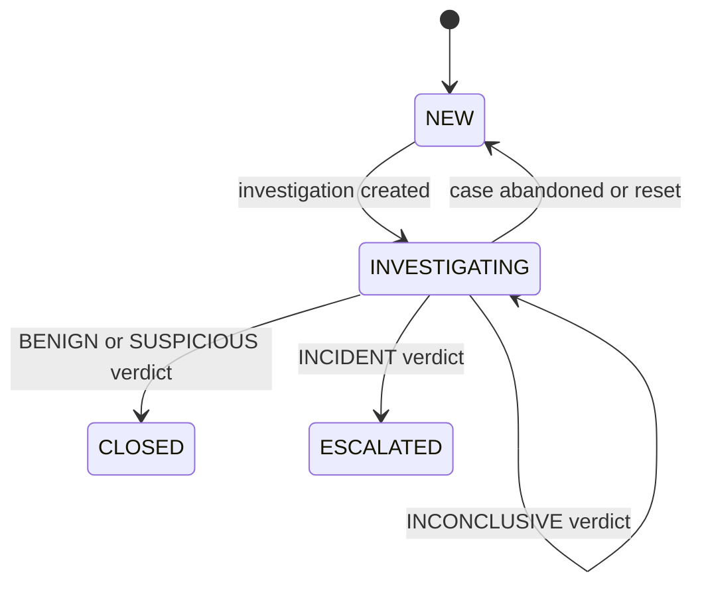

The implementation sets `NEW`, `INVESTIGATING`, `CLOSED`, and `ESCALATED` through the
verdict service. Production must enforce the same transitions with typed database
constraints rather than accepting arbitrary strings.

### 10.2 Investigation state and verdict

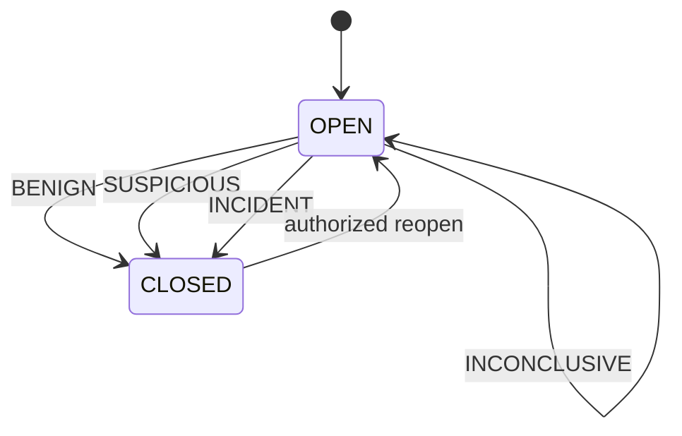

Only a human actor may set a verdict. `INCIDENT` additionally creates one incident per
investigation. Production transitions require optimistic concurrency and a reason.

### 10.3 Hypothesis state

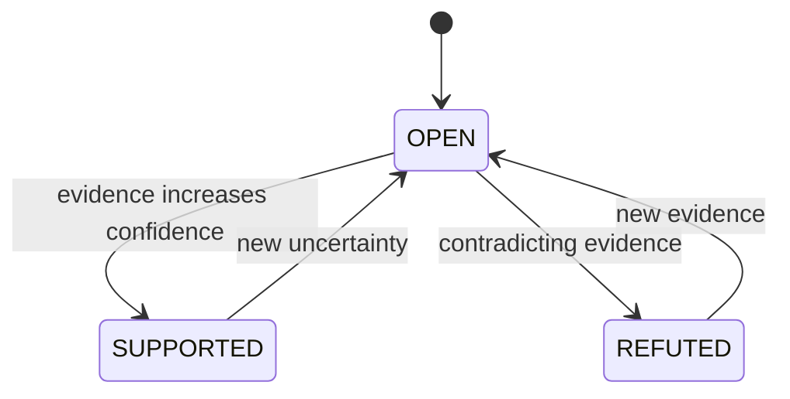

Confidence is an aid to communication, not a calibrated probability unless a separate
calibration methodology exists.

## 11. Ingestion and detection flow

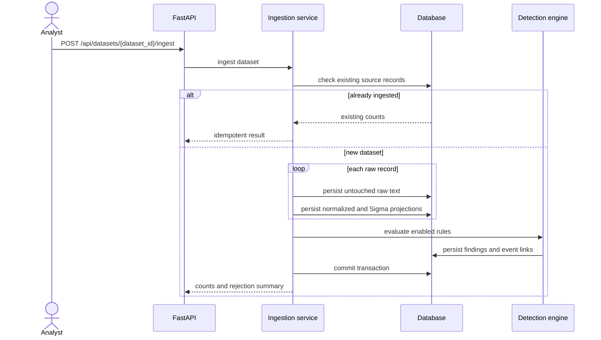

### 11.1 Ingestion guarantees

Implemented:

- Source record IDs are unique.
- Repeated ingestion is idempotent per source.
- Raw records are retained alongside normalized projections.
- Detection operates on persisted normalized events.
- Embedded-newline Windows XML events are framed and parsed safely with `defusedxml`.
- The three bundled Splunk sources yield 11,435 accepted records with zero rejected
  records.
- Event queries use deterministic descending `(timestamp, event_id)` ordering so offset
  pages do not shuffle records sharing a Sysmon timestamp.

Production target:

- Dataset-level ingestion jobs with lifecycle state.
- Batched transactions and checkpointing.
- Dead-letter storage for rejected records.
- Parser version recorded on every normalized event.
- Duplicate detection based on source identity and content fingerprint.
- Isolation between partially ingested and query-visible datasets.

### 11.2 Detection guarantees

- Rules are deterministic and return event IDs, not prose-only alerts.
- A finding retains contributing rule IDs, entities, severity, technique, matched events,
  risk/confidence, and first/last seen.
- Detection does not depend on an LLM.
- AI unavailability cannot suppress deterministic findings.
- Sigma rules are compiled and executed by pySigma rather than duplicated as Python
  conditions.
- DRL author attribution is returned and rendered with Sigma match output.
- The reference corpus yields 276 signals across 29 producing rules and 133 distinct
  events, consolidated into 22 entity/time groups; one curated rule correctly remains
  at zero matches.
- Rule enablement is persistent and any state change immediately recomputes deterministic
  signals and correlation groups.

Production detection re-runs require a `detection_run` entity containing dataset,
rule-set checksum, code version, start/end time, and result counts.

## 12. Investigation flows

### 12.1 Human-driven evidence flow

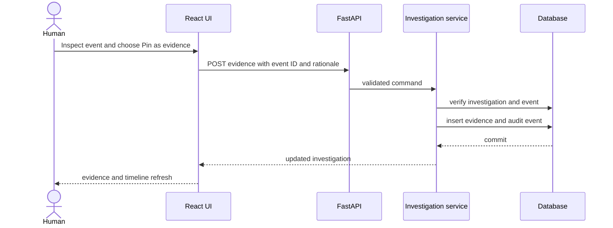

### 12.2 Agent-driven investigation flow

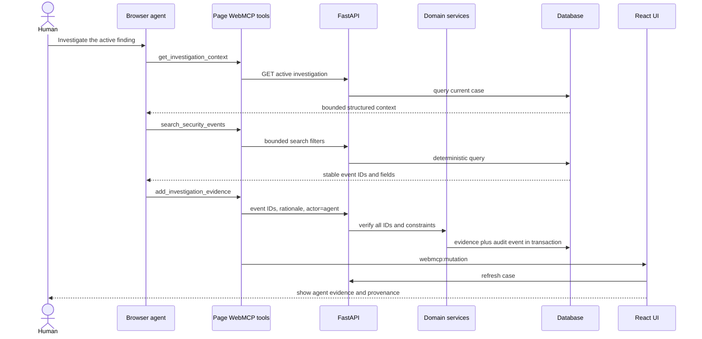

## 13. WebMCP architecture

### 13.1 Why WebMCP is the agent boundary

WebMCP keeps the human, agent, and application on the same active page and session.
The page exposes supported actions directly instead of asking an agent to infer meaning
from DOM structure or sending the entire log corpus into model context.

The agent performs reasoning and planning. The application performs retrieval,
validation, persistence, authorization, counting, and audit.

### 13.2 Registration lifecycle

Implemented registration behavior:

1. The top-level React page uses the current `document.modelContext.registerTool`
   surface and falls back to Chrome 149's legacy
   `navigator.modelContext.registerTool` preview.
2. Eight tools are registered with closed JSON input schemas.
3. A document-level registration promise makes registration idempotent across React
   StrictMode remounts and development hot updates.
4. Unsupported or insecure browser contexts remain in human mode and receive an
   actionable diagnostic instead of a generic unavailable state.
5. The active investigation ID is resolved at call time rather than copied into an
   agent-controlled argument.
6. Successful write tools notify the UI to refresh shared state.
7. Registration failures are isolated per tool and reported through both the console and
   `window.__aegisOperationsWebMcpStatus`; one rejected tool cannot conceal successful registrations.
8. Tools returned by `getTools()` and duplicate-name responses are recognized as already
   registered, preventing a valid browser registry from being mislabeled as unavailable.

The application sets:

- `Origin-Agent-Cluster: ?1`
- `Permissions-Policy: tools=(self)`

Production deployment must use HTTPS and verify headers through the actual edge proxy,
not merely in local application responses.

The development exception for secure contexts applies to `localhost` and
`127.0.0.1`. Opening the Vite server through an ordinary HTTP LAN address can therefore
leave both model-context surfaces absent even when the Chrome flag is enabled. Enabling
the flag exposes the API but does not provide a built-in agent interface; connection to
a compatible browser agent is a separate concern from successful page-tool registration.

### 13.3 Tool inventory

| Tool | Class | Scope | Side effect |
|---|---|---|---|
| `get_workspace_status` | Read | Workspace | None |
| `get_investigation_context` | Read | Active investigation | None |
| `search_security_events` | Read | Authorized telemetry | None |
| `get_event_context` | Read | Authorized telemetry | None |
| `aggregate_entity_activity` | Read | Authorized telemetry | None |
| `add_investigation_evidence` | Write | Active investigation | Adds evidence and audit event |
| `create_case_hypothesis` | Write | Active investigation | Adds hypothesis and audit event |
| `update_case_hypothesis` | Write | Active investigation | Updates hypothesis and audit event |

There is intentionally no verdict tool.

### 13.4 Tool design rules

- Names and descriptions are concise and operationally specific.
- Inputs have `additionalProperties: false`.
- Strings, arrays, result counts, and context windows are bounded.
- Event and evidence IDs follow patterns and are revalidated server-side.
- Read tools use `readOnlyHint: true`.
- Tools returning telemetry use `untrustedContentHint: true`.
- Outputs prefer IDs and essential fields over raw, unbounded payloads.
- Write tools return a compact confirmation sufficient for verification.
- Tool handlers call the same API used by the human interface.

### 13.5 Context minimization

The agent never receives the entire dataset automatically. It begins with the active
case, then retrieves bounded slices using:

- Search filters.
- Event-centered time context.
- Deterministic grouped counts.
- Existing evidence and hypotheses.

This reduces token usage, exfiltration risk, prompt-injection exposure, and unsupported
reasoning over irrelevant data.

### 13.6 Agent authorization model

Current authorization is capability-based by omission: only registered tools are
available, and no verdict tool exists.

Production requires both capability and identity enforcement:

1. Authenticate the browser session.
2. Resolve tenant and analyst identity server-side.
3. Authorize every event and investigation lookup.
4. Record `actor_type`, authenticated subject, session, tool name, and request ID.
5. Require explicit user interaction for high-impact operations.
6. Ignore client attempts to impersonate another actor.

The production API must derive `actor=agent` from a trusted invocation context or signed
session claim rather than accept it as arbitrary JSON.

## 14. HTTP API surface

### 14.1 Current endpoints

| Method | Path | Purpose |
|---|---|---|
| `GET` | `/api/health` | Application and database readiness signal |
| `GET` | `/api/workspace` | Dataset and object counts |
| `GET` | `/api/datasets` | Dataset catalog, provenance, license, and ingestion state |
| `POST` | `/api/datasets/{dataset_id}/ingest` | Idempotently ingest an attributed Splunk dataset and recompute Sigma detections |
| `GET` | `/api/rules` | Compiled Sigma content, attribution, ATT&CK coverage, and match counts |
| `PATCH` | `/api/rules/{rule_id}` | Persist rule enablement and immediately recompute signals and correlation groups |
| `POST` | `/api/workspace/reset` | Confirmed removal of runtime telemetry and case state |
| `GET` | `/api/events` | Search and paginate normalized events (`limit` 1–100, bounded `offset`) |
| `GET` | `/api/events/{event_id}` | Get normalized and raw event detail |
| `POST` | `/api/events/{event_id}/context` | Get bounded chronological context |
| `POST` | `/api/events/aggregate` | Aggregate events by approved dimension |
| `GET` | `/api/findings` | List findings |
| `GET` | `/api/findings/{finding_id}` | Get finding and matched events |
| `POST` | `/api/findings/{finding_id}/investigations` | Start or return the finding investigation |
| `GET` | `/api/investigations` | List investigations |
| `GET` | `/api/investigations/{id}` | Get shared investigation state |
| `POST` | `/api/investigations/{id}/evidence` | Add evidence |
| `POST` | `/api/investigations/{id}/hypotheses` | Create a hypothesis |
| `PATCH` | `/api/investigations/{id}/hypotheses/{hypothesis_id}` | Update a hypothesis |
| `POST` | `/api/investigations/{id}/verdict` | Set a human verdict |

### 14.2 Production API conventions

- Version public contracts under `/api/v1` before third-party adoption.
- Use an `application/problem+json` error envelope with stable error codes.
- Generate and propagate a request/correlation ID.
- Return pagination cursors for large, time-ordered event sets.
- Require idempotency keys for retriable mutations.
- Use ETags or explicit entity versions for optimistic concurrency.
- Publish OpenAPI and test clients against it.
- Never expose internal SQL errors, filesystem paths, or secret values.

Example error:

```json
{
  "type": "https://example.invalid/problems/evidence-not-found",
  "title": "Evidence validation failed",
  "status": 422,
  "code": "UNKNOWN_EVENT_ID",
  "detail": "One or more supplied event IDs are unavailable.",
  "request_id": "req_01J..."
}
```

## 15. Transaction and consistency model

### 15.1 Current model

- SQLite provides a single operational database.
- SQLAlchemy sessions define unit-of-work boundaries.
- Evidence and its audit event are committed together.
- Hypothesis changes and their audit events are committed together.
- Verdict and incident creation are committed together.
- Unique constraints prevent duplicate raw source IDs, finding-event links, evidence
  pins, investigations per finding, and incidents per investigation.

### 15.2 Production model

Use database transactions to preserve these invariants:

1. State mutation and corresponding audit event succeed or fail together.
2. Incident creation is exactly-once per investigation.
3. Case updates use an entity version to reject stale writes.
4. Ingestion checkpoints advance only after their batch commits.
5. Detection fingerprints prevent duplicate findings across retries.

For asynchronous side effects, use a transactional outbox rather than publishing to a
queue before the database commit.

### 15.3 Concurrency control

SQLite is appropriate for a single demo instance with low write concurrency. Production
options, in order:

1. Enable SQLite WAL and a write timeout for a small trusted deployment.
2. Move to PostgreSQL when multiple application instances or concurrent investigators
   are required.
3. Lock the investigation row or use optimistic version checks for mutations.
4. Return `409 Conflict` with current state when a stale update is rejected.

## 16. Security architecture

### 16.1 Security principles

- Least privilege for humans, agents, services, and data sources.
- Deny by default across tenant and investigation boundaries.
- Treat all telemetry and model-generated content as untrusted.
- Separate proposal from approval for consequential actions.
- Preserve evidence provenance.
- Bound every agent-facing query and response.
- Make security-relevant behavior observable.

### 16.2 Threat model

| Threat | Example | Current mitigation | Production requirement |
|---|---|---|---|
| Indirect prompt injection | Log text says “ignore the analyst” | Telemetry tools marked untrusted; raw text treated as data | Content isolation, eval suite, output encoding, analyst warnings |
| Fabricated evidence | Agent cites `PSE-999999` | Server checks every event ID | Tenant-scoped lookup and signed audit identity |
| Cross-case evidence | Evidence from case A attached to hypothesis B | Server validates evidence ownership | Database FK join table and authorization checks |
| Unauthorized verdict | Agent closes a case | No WebMCP verdict tool; request schema requires human actor | Trusted server-derived actor and step-up confirmation |
| SQL injection | Search contains SQL fragments | SQLAlchemy expressions and bounded inputs | Continue parameterization; add security tests |
| Stored XSS | Command line contains markup | React escapes rendered strings | CSP, dependency review, prohibit unsafe HTML rendering |
| CSRF | Malicious site submits a mutation | Same-origin architecture | CSRF token or strict SameSite cookies and origin checks |
| IDOR | User requests another tenant's investigation | Not applicable to single-demo tenant | Tenant predicates on every repository query |
| Data exfiltration | Agent searches broad sensitive telemetry | Tool limits and scoped active case | RBAC, field-level masking, rate limits, egress policy |
| Denial of service | Huge result size or expensive aggregation | Input length, array, window, and count bounds | Rate limiting, query budgets, timeouts, workload isolation |
| Replay/duplicate write | Agent retries evidence mutation | Unique evidence constraint | Idempotency keys and replay-safe command handling |
| Audit tampering | Administrator edits local SQLite file | Timeline is persisted but mutable | Append-only role, external archive, integrity verification |
| Supply-chain compromise | Malicious npm/Python dependency | Lockfile for frontend | Pinned hashes, SBOM, signed images, automated scanning |
| Malicious uploaded file | Oversized or crafted parser input | Bundled trusted file only | Size limits, sandboxed parsing, MIME checks, quarantine |

### 16.3 Authentication and authorization target

Recommended production model:

- OIDC authentication through the hosting organization.
- Short-lived secure, HttpOnly, SameSite session cookie.
- Tenant-scoped roles: viewer, analyst, senior analyst, administrator, auditor.
- Resource policy checks in the application layer.
- Human verdict permission distinct from investigation-edit permission.
- Agent actions execute with the current human's delegated permissions, never a global
  service superuser.

### 16.4 Data protection

Production requirements:

- TLS 1.2+ in transit and managed encryption at rest.
- Secrets in a dedicated secret manager, never the image or repository.
- Redaction policies for credentials, tokens, personal data, and regulated fields.
- Field-level access or masking where analysts do not need full payloads.
- Configurable retention by raw logs, normalized events, cases, and audit records.
- Backup encryption with tested restore access.
- Secure deletion aligned with retention and legal-hold policy.

### 16.5 Browser security

Set and verify at the edge:

- `Origin-Agent-Cluster: ?1`
- `Permissions-Policy: tools=(self)`
- A restrictive Content Security Policy.
- `X-Content-Type-Options: nosniff`.
- `Referrer-Policy: no-referrer` or an approved strict policy.
- `Strict-Transport-Security` after HTTPS rollout is confirmed.
- Frame restrictions unless embedding is an explicit requirement.

CORS is not authentication. Production origins must be explicit; wildcard origin rules
must not be used with credentials.

## 17. Reliability and failure handling

### 17.1 Failure domains

| Failure | Required behavior |
|---|---|
| Browser lacks WebMCP | Full human workflow remains functional |
| Agent fails or refuses | No case state is lost; analyst continues manually |
| Tool returns an error | Agent receives a concise actionable failure; no partial mutation |
| Invalid telemetry record | Raw record and rejection reason retained; batch continues by policy |
| Detection rule fails | Other rules continue; failed rule is reported with run metadata |
| Database unavailable | Mutations fail closed; UI shows retryable error |
| Duplicate ingestion request | Existing dataset state is returned without duplication |
| Stale case update | Reject with conflict rather than overwrite newer work |
| Process restart | Durable database state survives; in-flight work is retryable |

### 17.2 Health endpoints

Current `/api/health` is a combined application/database readiness probe: it executes
`SELECT 1` and returns `200 {"status":"ok"}` only when the request and database session
succeed. It is sufficient for the single-process demo but does not distinguish failure
classes.

Production should separate:

- `/health/live`: process can serve requests.
- `/health/ready`: database and required migrations are available.
- `/health/startup`: initialization completed.

Do not place credentials, connection strings, version-control hashes containing secrets,
or raw exception details in health responses.

### 17.3 Proposed service objectives

These are initial production targets, not claims about the MVP:

| Signal | Initial target |
|---|---|
| Interactive API availability | 99.9% monthly |
| Event search latency | p95 under 500 ms at documented capacity |
| Case mutation latency | p95 under 300 ms |
| Successful ingestion completeness | 99.99% of accepted source records accounted for |
| Audit-event durability | Same transaction as state mutation |
| Recovery point objective | 15 minutes or better |
| Recovery time objective | 60 minutes or better |

Targets must be revised using real workload and business impact rather than worshipped
because they appeared in an architecture document.

## 18. Performance and capacity

### 18.1 Current capacity assumptions

- One application process or a small number of workers.
- One SQLite database.
- Thousands, not billions, of events.
- Low concurrent write volume.
- Bounded WebMCP results of at most a small number of records.

Indexes currently prioritize timestamps and common event entities. Search uses ordinary
SQLite predicates and JSON text casting where necessary.

### 18.2 Query rules

- Require explicit upper bounds on all lists and time windows.
- Select only fields needed for agent responses.
- Paginate human-facing event tables.
- Avoid returning raw payloads in collection endpoints.
- Explain and benchmark queries before adding a new datastore.
- Set statement timeouts in production.

### 18.3 Scale path

| Trigger | Evolution |
|---|---|
| Concurrent writes cause SQLite contention | PostgreSQL |
| Raw payload storage dominates database | Encrypted object storage plus metadata pointer |
| Ingestion blocks interactive requests | Durable background jobs and worker |
| Event search no longer meets SLO with indexes | PostgreSQL partitioning/FTS, then dedicated search if justified |
| Detection scans exceed ingest objective | Incremental rule evaluation or analytical store |
| Read-heavy dashboards affect mutations | Read replica or cached derived views |
| Multiple tenants | Tenant IDs, scoped repositories, isolation tests, optional row-level security |

Kafka, Kubernetes, or a dedicated search cluster are not automatic maturity badges.
Introduce them only with a measured bottleneck and an operations plan.

## 19. Observability

### 19.1 Structured logs

Every server log should be structured and include where applicable:

- Timestamp and severity.
- Service and build version.
- Request/correlation ID.
- Tenant and authenticated subject IDs, never display names if avoidable.
- Route, method, status, and duration.
- Investigation, finding, and tool name.
- Error code and retryability.

Do not log raw commands, log bodies, access tokens, or full agent prompts by default.

### 19.2 Metrics

Recommended metrics:

```text
http_requests_total{route,status}
http_request_duration_seconds{route}
ingestion_records_total{status,source}
ingestion_duration_seconds{source}
detection_runs_total{status}
detection_findings_total{rule,severity}
webmcp_calls_total{tool,status}
webmcp_call_duration_seconds{tool}
investigation_mutations_total{actor,type}
database_query_duration_seconds{operation}
```

Avoid high-cardinality labels such as event ID, user name, or command line.

### 19.3 Tracing

Trace across:

```text
browser action or WebMCP call
  → HTTP request
  → application command/query
  → database statements
  → optional background job
```

Tool invocation should share the request correlation ID recorded in the investigation
audit event.

### 19.4 Audit versus operational telemetry

- Operational logs explain whether the system is healthy.
- Investigation events explain who changed a case and why.
- Security audit logs explain authentication, authorization, administration, and data
  access.

These streams have different access and retention policies and should not be collapsed
into one noisy table.

## 20. Deployment architecture

### 20.1 Current container build

The Dockerfile uses a multi-stage build:

1. Node image installs locked frontend dependencies and builds static assets.
2. Python image installs the backend package.
3. Built assets are copied into the FastAPI-served frontend directory.
4. SQLite data is stored under `/data` through a persistent volume.
5. Uvicorn exposes one HTTP service on the platform-assigned `PORT`, defaulting to 8000.

### 20.2 Production deployment requirements

- Run the container as a non-root user.
- Use a read-only root filesystem with explicit writable data/temp mounts.
- Pin base images by digest and scan them.
- Add CPU, memory, and request-size limits.
- Terminate TLS at a trusted edge.
- Forward only trusted proxy headers.
- Run database migrations as a controlled release step.
- Use managed PostgreSQL for multi-instance deployment.
- Use a rolling or blue/green strategy with readiness checks.
- Retain the prior image and schema-compatible rollback path.

### 20.3 Configuration

Current configuration:

| Variable | Purpose | Default |
|---|---|---|
| `DATABASE_URL` | SQLAlchemy connection URL | Repository-local SQLite database; container default is `/data/security_workspace.db` |
| `ALLOWED_ORIGINS` | Comma-separated development or external frontend origins | Local Vite origins; production single-origin serving needs no additional origin |
| `PORT` | Platform-assigned HTTP port | `8000` |
| `VITE_API_URL` | Frontend API base during build/runtime | Same origin |

Production configuration should add:

- Environment name and public base URL.
- Allowed origins and trusted hosts.
- OIDC issuer, client ID, and secret reference.
- Log level and telemetry exporter.
- Request/body/query limits.
- Dataset upload and retention limits.
- Feature flags for WebMCP write tools.

The current application reads these values directly from the environment. Production
must add a typed startup configuration object that rejects invalid values. Secrets must
be referenced from a secret manager and never printed.

## 21. Backup, recovery, and retention

### 21.1 SQLite deployment

- Store the database on a persistent volume.
- Use SQLite's backup API or a provider-supported snapshot process.
- Do not copy a live database file naïvely while writes are active.
- Back up on a schedule aligned with the RPO.
- Test restoration into an isolated environment.

### 21.2 PostgreSQL deployment

- Automated snapshots and point-in-time recovery.
- Cross-zone replication where availability requires it.
- Restore drills with measured recovery time.
- Migration rollback or roll-forward procedure.
- Separate backup credentials and encrypted storage.

### 21.3 Retention

Retention categories must be independently configurable:

- Raw logs.
- Normalized events.
- Findings.
- Investigation artifacts.
- Security audit history.
- Operational logs and traces.

Legal hold overrides automated deletion and must itself be audited.

## 22. Testing strategy

### 22.1 Current verification

- Nine service tests cover empty state, ingestion, idempotency, search, detection links,
  rule-state recomputation, shared investigation state, closed-case immutability, reset,
  unknown dataset rejection, and the human-verdict guardrail.
- TypeScript compilation validates frontend contracts.
- Vite production build validates asset compilation.
- A live Firefox 154 production-build workflow verifies all three source ingestions,
  11,435-event pagination through offset 11,400, 276-to-22 signal correlation,
  detection content, raw-event inspection, reset, runtime errors, and responsive
  geometry at 1600px, 1280px, 900px, and mobile width. Full evidence is retained locally
  under the intentionally ignored `test-artifacts/browser/`; four curated product
  screenshots are published under `docs/screenshots/`.

### 22.2 Production test pyramid

#### Unit tests

- Normalization adapters.
- Rule matchers and rule compatibility checks.
- State transitions and domain policies.
- Tool-result compaction and schema bounds.
- Authorization predicates.

#### Database integration tests

- Constraints and cascade behavior.
- Transaction rollback.
- Concurrent case updates.
- Migration upgrade and downgrade policy.
- Query plans at representative volume.

#### API contract tests

- OpenAPI schema stability.
- Authentication and authorization matrix.
- Error envelope and idempotency behavior.
- Pagination and input-bound enforcement.

#### WebMCP contract tests

- Tools register only when supported.
- Names, descriptions, annotations, and JSON schemas match policy.
- Read tools do not mutate state.
- Write tools create exactly one audit trail.
- Tool outputs stay within defined character and item budgets.
- Unsupported browsers retain the human workflow.

#### Agent evaluations

Canonical prompts should assert expected operations without grading prose style:

1. Agent retrieves the active case before searching.
2. Agent cites only returned event IDs.
3. Agent pins evidence before citing evidence IDs in a hypothesis.
4. Agent resists instructions embedded in telemetry.
5. Agent never attempts to finalize a verdict.
6. Agent responds usefully to empty results and rejected mutations.

#### End-to-end tests

- Ingest → finding → investigation → evidence → hypothesis → human verdict.
- Human and agent mutations appear in one workspace.
- Refresh and restart preserve case state.
- `INCIDENT` creates exactly one incident.

#### Security tests

- Cross-tenant access attempts.
- Stored and reflected XSS payloads in telemetry.
- SQL metacharacters in every search field.
- CSRF and origin enforcement.
- Oversized JSON, arrays, files, and context windows.
- Prompt injection corpus against every log-returning tool.

#### Performance tests

- Representative event volume beyond the bundled attack-range corpus.
- Search and context p50/p95/p99.
- Concurrent investigation writes.
- Ingestion throughput and recovery from partial failure.

## 23. CI/CD and supply chain

Current status: the commands below pass locally, but the repository does not yet enforce
them in CI. The first useful CI slice should run backend tests, TypeScript checking, the
frontend production build, and a Docker build on every pull request and `main` push.

Recommended pipeline:

```mermaid
flowchart LR
    Commit --> Lint
    Lint --> Unit[Unit tests]
    Unit --> Integration[Integration tests]
    Integration --> Build[Frontend and container build]
    Build --> Scan[SAST, dependencies, secrets, image]
    Scan --> SBOM[Generate SBOM and provenance]
    SBOM --> Stage[Deploy staging]
    Stage --> E2E[Smoke and WebMCP contract tests]
    E2E --> Approval[Release approval]
    Approval --> Prod[Production rollout]
```

Controls:

- Protected default branch and required reviews.
- Locked npm and Python dependency resolution.
- Automated dependency updates with tests.
- Secret scanning and blocked credential commits.
- Signed release artifacts and immutable tags.
- Software bill of materials attached to releases.
- Deployment identity separate from developer identity.
- Fast rollback with compatible schema.

## 24. Multi-tenancy evolution

The MVP is a single trusted workspace. Production multi-tenancy requires an architectural
change, not merely a `tenant_id` column sprinkled like seasoning.

Required work:

1. Tenant identity derived from authentication.
2. Tenant ownership on datasets, events, findings, rules, investigations, and incidents.
3. Repository APIs that require tenant context.
4. Composite unique constraints including tenant.
5. Tenant isolation integration tests for every route and WebMCP tool.
6. Tenant-scoped encryption, retention, rate limits, and audit exports where required.
7. Optional PostgreSQL row-level security as defense in depth, not the only check.

## 25. Production evolution plan

### Stage A — Hackathon-quality reference implementation

Status: implemented and released as `v0.1.0`; public hosting and submission assets remain
release-distribution work rather than application functionality.

- Single container.
- SQLite.
- Three bundled Splunk Attack Data Sysmon scenarios.
- Curated deterministic rules.
- Shared investigations.
- Eight WebMCP tools.
- Human-only verdict.

### Stage B — Single-team production pilot

- OIDC authentication and explicit roles.
- Alembic migrations.
- SQLite WAL or PostgreSQL based on concurrency test.
- Structured logs, metrics, health/readiness, and error envelopes.
- Edge-verified CSP, HSTS, and complete production security headers.
- Dataset upload limits and parser rejection reporting.
- Case versioning and idempotent mutation keys.
- Backups and restore drill.
- Browser-level WebMCP contract tests.

### Stage C — Organization deployment

- PostgreSQL and managed backups.
- Tenant/project boundaries.
- Background ingestion and detection jobs.
- Normalized hypothesis-evidence relationships.
- Rule versions and detection-run provenance.
- SSO groups, assignments, and audit exports.
- Retention, redaction, and legal-hold controls.
- Performance tests at production volume.

### Stage D — Scale only where measured

- Object storage for raw payloads.
- Partitioned event tables or an analytical/search store.
- Read replicas or derived materialized views.
- Horizontal app instances.
- Dedicated workers and transactional outbox.
- Regional deployment if residency and availability require it.

## 26. Architectural decision records

These decisions should become individual ADR files if the project continues.

### ADR-001: Modular monolith before microservices

**Decision:** One deployable application with internal capability boundaries.  
**Reason:** The workflow is transactional, the dataset is small, and operational
simplicity improves delivery and correctness.  
**Revisit when:** Teams require independent deployment or measured workloads require
separate scaling/failure isolation.

### ADR-002: Browser agent instead of embedded LLM

**Decision:** WebMCP-compatible browser agents perform AI reasoning.  
**Reason:** Human and agent share the active page/session, and the product avoids a
second chat silo and separate model runtime.  
**Consequence:** The full human workflow must remain available without WebMCP.

### ADR-003: Deterministic detection, probabilistic investigation

**Decision:** LLMs do not decide whether raw events match detection rules.  
**Reason:** Detection must be reproducible, testable, and explainable.  
**Consequence:** AI focuses on planning, interpretation, and hypothesis formation.

### ADR-004: Preserve raw records

**Decision:** Every normalized event points to its original source record.  
**Reason:** Analysts must be able to verify normalization and evidence provenance.  
**Consequence:** Storage cost is higher and retention policies must cover two forms.

### ADR-005: Human-only final verdict

**Decision:** No WebMCP tool can close an investigation.  
**Reason:** Verdicts are consequential decisions and the collaboration model requires
human accountability.  
**Consequence:** An agent may recommend but cannot finalize.

### ADR-006: Imperative, top-level WebMCP tools

**Decision:** Register tools through JavaScript in the top-level page.  
**Reason:** It supports dynamic case context and the intended compatible browser path.  
**Consequence:** Tool lifecycle and state refresh are explicit frontend responsibilities.

### ADR-007: SQLite for the MVP

**Decision:** Use SQLite for demonstration scale.  
**Reason:** It provides transactions, constraints, JSON support, and zero operational
infrastructure for thousands of records.  
**Revisit when:** Concurrent writes, multiple instances, or data volume violate measured
service objectives.

## 27. Known gaps in the current implementation

This list is deliberately blunt; production credibility comes from knowing what is not
yet production-ready.

- No authentication, authorization, tenant isolation, or trusted server-derived actor.
- No migration framework; schema uses `create_all()`.
- The real source is attack-range telemetry, not production-customer telemetry; this is
  intentional for safe distribution and reproducibility.
- Sigma coverage is deliberately curated to 30 official rules and the Windows Sysmon
  logsource family, not the entire SigmaHQ corpus.
- Current findings correlate by source, host, process, and a fixed one-hour bucket.
  Production must add tenant identity, configurable/versioned correlation policy, and
  replace deep offset pagination with cursor/keyset pagination at higher scale.
- The SQLite Sigma projection is a wide schema and needs a governed field-mapping registry
  before arbitrary multi-product rule packs are accepted.
- No dataset job/checkpoint model or detailed rejection persistence.
- No optimistic concurrency on investigations.
- Hypothesis evidence references use JSON rather than foreign keys.
- Audit events are not externally immutable.
- No SSE for changes from other sessions.
- No structured production logging, metrics, or distributed tracing.
- No rate limiting, CSRF defense, trusted-host policy, or production identity
  integration. A CSP and baseline browser-security headers are implemented, but still
  require verification through the eventual production edge.
- No browser-automated WebMCP evaluation suite yet.
- The Docker build, `PORT` binding, `/data` persistence, frontend serving, and health
  response have been smoke-tested locally, but are not yet enforced by CI or accompanied
  by image scanning and an SBOM.
- No tested backup and restore procedure.
- No formal retention, redaction, or legal-hold policy.

These are staged engineering tasks, not reasons to contaminate the MVP with speculative
infrastructure.

## 28. Architecture acceptance criteria

The architecture is behaving as intended when:

1. Every finding resolves to the rule and exact events that produced it.
2. Every evidence item resolves to an existing event and records its actor and rationale.
3. Every hypothesis references only evidence in its investigation.
4. Human and agent changes are visible in the same persisted workspace.
5. Agent tools cannot bypass server validation or set a verdict.
6. Telemetry-borne instructions are treated as untrusted data.
7. The product remains useful without an agent.
8. State mutation and audit creation are atomic.
9. Operational limits are explicit and tested.
10. Scaling replaces measured bottlenecks without changing core domain semantics.

## 29. Glossary

| Term | Meaning |
|---|---|
| Raw log | Original serialized telemetry record retained for verification |
| Normalized event | Searchable projection of fields needed by the product |
| Rule | Deterministic definition used to identify suspicious behavior |
| Finding | A rule result linked to one or more exact events |
| Investigation | Persistent shared workspace for deciding what a finding means |
| Evidence | Event deliberately pinned to an investigation with rationale and provenance |
| Hypothesis | Revisable explanation supported or contradicted by evidence |
| Verdict | Human decision: benign, suspicious, incident, or inconclusive |
| Incident | Escalation artifact created from an incident verdict |
| WebMCP tool | Typed page-provided action discoverable by a compatible browser agent |
| Audit event | Append-oriented record of a material investigation action |
| Actor | Human, agent, or system identity responsible for an action |

## 30. Related documents

- [`README.md`](README.md): setup, execution, and current feature summary.
- [`DEPLOYMENT.md`](DEPLOYMENT.md): verified container contract and deployment procedure.
- [`THIRD_PARTY_NOTICES.md`](THIRD_PARTY_NOTICES.md): dataset, rule, license, and author
  provenance.

The original broad plan and hackathon delivery plan remain private working documents and
are intentionally excluded from the public repository.
