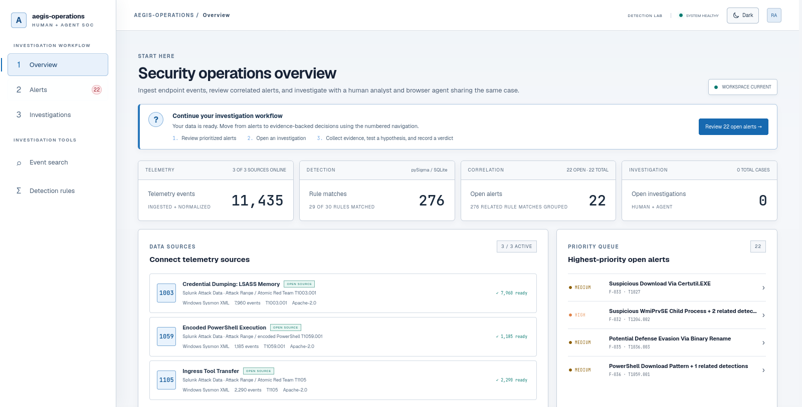
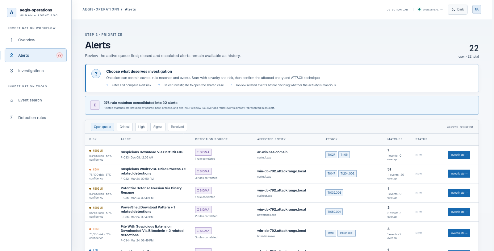
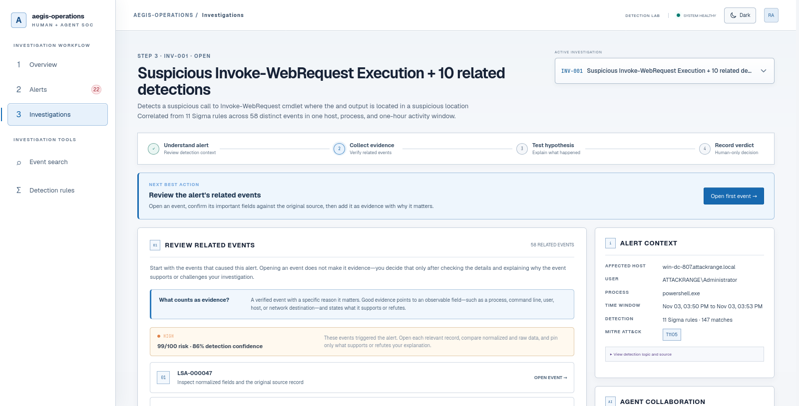
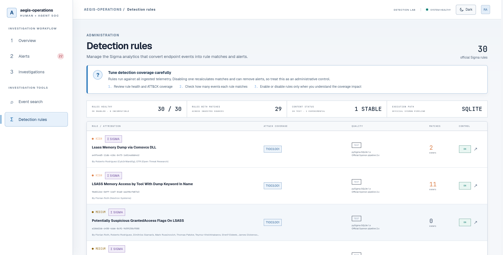

<div align="center">
  
  <h1>aegis-operations</h1>
  <p><strong>Evidence-grounded security operations for human analysts and browser agents.</strong></p>
  <p>Ingest authentic endpoint telemetry, evaluate official Sigma rules, correlate alerts,
  and investigate every decision against the same shared case record.</p>
  <p>
    <code>11,435 events</code>&nbsp;&nbsp;
    <code>30 Sigma rules</code>&nbsp;&nbsp;
    <code>22 correlated alerts</code>&nbsp;&nbsp;
    <code>8 WebMCP tools</code>
  </p>
  <p>
    <a href="./ARCHITECTURE.md">Architecture</a> ·
    <a href="./DEPLOYMENT.md">Deployment</a> ·
    <a href="./THIRD_PARTY_NOTICES.md">Data and rule attribution</a>
  </p>
</div>



> Detection raises the question. Human and agent collaborate to determine the answer.

`aegis-operations` is a demonstration-scale SOC investigation product where a human
analyst and a browser agent work against the same evidence, hypotheses, and audit
timeline. It remains fully usable as a human-first security tool when WebMCP is not
available.

## What is implemented

- FastAPI, SQLAlchemy, and SQLite backend
- React and TypeScript security-console interface
- Idempotent ingestion of 11,435 raw Sysmon XML events from three Splunk Attack Data
  attack-range datasets covering T1003.001, T1059.001, and T1105
- Exact raw-record retention plus normalized and Sigma query projections
- Official pySigma, SQLite backend, and Sysmon processing pipeline integration
- Thirty unmodified SigmaHQ rules with compiled-query, complete ATT&CK mappings, license,
  source, status, and author provenance
- Rule compatibility health, persistent enable/disable controls, and immediate detection
  recomputation as sources or content state change
- Reference result of 276 rule-event signals from 29 producing rules, consolidated into
  22 source/host/process/hour triage groups over 133 distinct events
- Deterministic risk and confidence scores plus 143 explicitly measured overlapping signals
- Confirmed workspace reset that clears cases and telemetry without removing source content
- Deterministically ordered log explorer with search, 25/50/100-row pagination,
  First/Previous/Next/Last navigation, and access to all 11,435 records
- Guided Overview → Alerts → Investigations workflow with plain-language page instructions
- Correlation-aware alert queue, normalized/raw event drawer, and staged investigation
  workbench that distinguishes related events from verified evidence and requires an
  observable, analyst-written rationale before an event enters the case record
- Progressive disclosure for high-volume alerts, with the first eight related events
  shown initially and every event still available on demand
- Persistent accessible light and dark themes that respect the initial system preference
- Pre-render theme initialization that prevents a dark loading flash when light mode is
  saved or preferred by the operating system
- Locally bundled Geist Sans interface typography and JetBrains Mono for machine data,
  IDs, detection queries, and original source records
- Responsive SOC console layout verified at desktop, compact-sidebar, and mobile widths
- Shared evidence, hypotheses, provenance, timeline, verdict, and incident state
- Complete case lifecycle: conclusive verdicts leave the active queues and become read-only
  investigation history; `INCONCLUSIVE` intentionally retains an open case
- Separate open-versus-total alert and investigation metrics, plus a resolved-alert filter
- Eight top-level imperative WebMCP tools
- Guardrails against invented event/evidence IDs and agent-set final verdicts
- Explicit untrusted-content annotations for log-returning tools

## Product tour

### Prioritize correlated alerts



### Investigate with an evidence-first workflow



### Inspect and control detection content



## Why WebMCP

The page exposes investigation operations directly to compatible browser agents.
The agent can search telemetry, retrieve context, aggregate activity, pin evidence,
and create or update hypotheses. Those changes appear in the same workspace the
human is reviewing. No DOM guessing and no separate chatbot database are required.

The final verdict remains a human-only action.

The full investigation workflow is also available without an agent: open an alert,
review its related events, pin verified evidence with a rationale, create an
evidence-linked hypothesis, and record the analyst verdict. WebMCP adds a collaborator;
it is not a prerequisite for operating the product.

## Local development

Requirements: Python 3.12+, Node.js 22+, and npm.

```bash
python3 -m venv .venv
source .venv/bin/activate
pip install -e '.[dev]'

cd app/frontend
npm install
npm run dev
```

In a second terminal:

```bash
source .venv/bin/activate
uvicorn app.backend.main:app --reload
```

Open `http://localhost:5173`. The Vite server proxies `/api` to FastAPI.

## WebMCP testing

Use ChatGPT's in-app browser or Chrome 149+ with
`chrome://flags/#enable-webmcp-testing` enabled, then click **Relaunch**. Serve the
workspace from `http://localhost:5173`, `http://127.0.0.1:5173`, or HTTPS; WebMCP is not
exposed on an insecure LAN/IP origin. Open an investigation and try:

> Investigate the active finding. Identify and add the strongest evidence, then
> create an evidence-linked hypothesis. Do not set the final verdict.

The expected workflow uses `get_investigation_context`,
`search_security_events`, `get_event_context`,
`add_investigation_evidence`, and `create_case_hypothesis`.

The flag exposes the browser API; it does not itself add an agent chat UI. The workspace
supports both Chrome 149's `navigator.modelContext` surface and the newer
`document.modelContext` surface. Check the exact runtime state in DevTools:

```js
window.isSecureContext
document.modelContext ?? navigator.modelContext
window.__aegisOperationsWebMcpStatus
await (document.modelContext ?? navigator.modelContext)?.getTools?.()
```

The first value must be `true`, the second must be a model context, and the status should
report eight registered tools. Browsers without WebMCP retain the full human workflow
and show an actionable reason in the navigation rail.

Registration is document-idempotent. React development remounts, Vite hot updates, or
tools already present in the browser registry are treated as the same eight tools rather
than as a fatal duplicate-name error.

## Tests

```bash
pytest
cd app/frontend && npm run build
```

The production-build browser workflow covers all three source ingestions,
event pagination through the final page, Sigma correlation, the densest 58-event alert,
related-event progressive disclosure, wrapped original-source inspection, the complete
manual investigation path, persistent light mode, responsive geometry, and guarded reset.
Browser evidence is generated locally under the intentionally ignored `test-artifacts/`
directory; the curated product screenshots above are maintained under `docs/screenshots/`.

## Docker

```bash
docker build -t aegis-operations .
docker run --rm -p 8000:8000 -v aegis-operations-data:/data aegis-operations
```

Open `http://localhost:8000`.

## Deployment

The recommended hackathon deployment is a single Railway service built from the
Dockerfile, with a persistent volume mounted at `/data` and a generated HTTPS domain.
The application binds to the platform `PORT`, checks database readiness at
`/api/health`, and emits the required WebMCP and production browser-security headers.

See [`DEPLOYMENT.md`](DEPLOYMENT.md) for the exact Railway steps, post-deployment checks,
storage constraints, alternative hosts, and the boundary between demo-ready and
enterprise production-ready.

## Dataset note

All bundled telemetry comes from Splunk Attack Data: LSASS memory access, encoded
PowerShell, and ingress tool transfer scenarios. The files contain authentic Windows
event XML captured in attack-range labs; they are real security telemetry, but are not
claimed to come from production victims. No project-generated synthetic dataset remains.
Findings are generated at runtime through pySigma and are never hardcoded.

### Understanding the detection counts

The 11,435 records are telemetry, not 11,435 alerts. With the current 30-rule Sigma
pack, 29 rules produce 276 rule-event matches over 133 distinct events. The queue
consolidates those matches into 22 correlated alerts using source, host, process, and a
fixed one-hour window. The remaining 143 overlapping signals are retained and counted;
they are not inflated into duplicate analyst work items. Every group retains its exact
supporting event IDs, contributing rule IDs, entities, risk/confidence scores, rule
attribution, and compiled query.

This is intentional alert correlation, not missing data. Event Search exposes
the complete dataset with deterministic pagination, including the final 35-record page.

Third-party artifacts, licenses, and Sigma author attribution are documented in
[`THIRD_PARTY_NOTICES.md`](THIRD_PARTY_NOTICES.md).

## Documentation

- [`ARCHITECTURE.md`](ARCHITECTURE.md) documents the implemented architecture,
  production target, security model, operations, and scale path.
- [`DEPLOYMENT.md`](DEPLOYMENT.md) contains the verified container contract and Railway
  deployment procedure.
- [`THIRD_PARTY_NOTICES.md`](THIRD_PARTY_NOTICES.md) records upstream dataset and Sigma
  attribution.

## License

MIT
